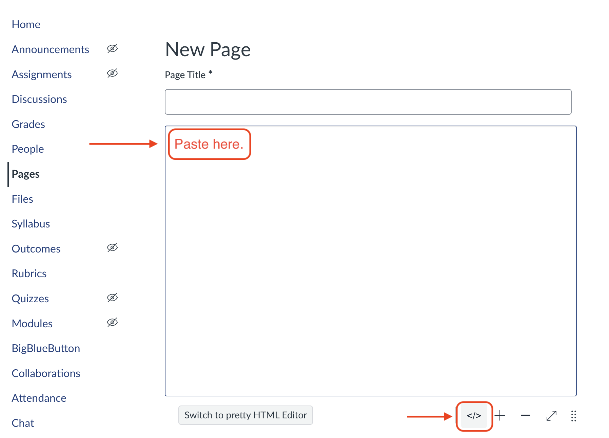
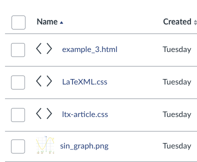
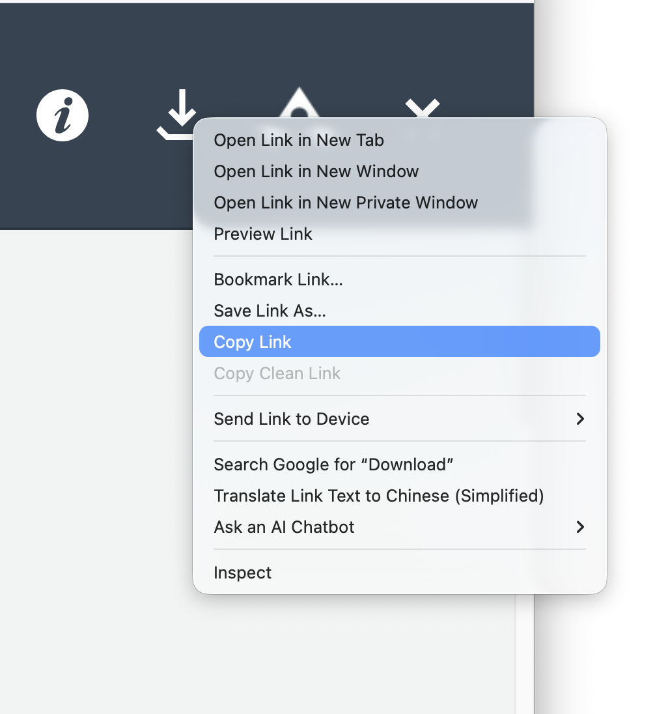

# Using LaTeXML to create Canvas pages

HTML files currently offer the best accessibility features.

Please follow [the instructions](https://math.nist.gov/~BMiller/LaTeXML/get.html) to install LaTeXML. Depending on your system, you may need to pre-install something first.


## Workflow

Flowchart:

```{mermaid}
flowchart LR
    A(*.tex File) --> |LaTeXML| B(*.html)
    B --> |upload| C(Canvas Files)
    C --> |embed| D(Publish Canvas Page)
    B --> |copy-paste| D
```


## Step 1. Conversion to HTML via LaTeXML

To convert `example_1.tex` to an accessible HTML file, run the following command in a terminal

```bash
latexmlc example_1.tex --dest=example_1.html
```

A message will be printed, listing possible failures in the conversion. Here's a [list of known failures]() and some [pre-conversion suggestions]() to better prepare tex file. See also [examples]() for things that are known to work well.

It will always creates a usable `example_1.html`, alongside two more css-file, `LaTeXML.css` and `ltx-article.css`, and a log file. You may open the HTML file with a browswer to see if everything is correctly formatted.

## Step 2: Add to Canvas

There are two methods of creating a Canvas Page.

### Copy-Paste

**Instructions**:

1. Open the HTML file in a text editor
2. Select everything and copy.
3. Go to the canvas course page, and create a New Page under the Page tab.
4. Click the `</>` icon to switch to HTML Editor and paste the contents there. (See the figure below.)
5. You may save the page to preview and switch back to the Canvas's Rice Content Editor to fix formatting issues and to add links to files and images.

{width=600}


::: {.callout-note}

- Pros:
    - Simple
    - Easier for future edits 
- Cons:
    - Links to files and images (e.g. `\includegraphics`) need to be manually fixed

:::


### Embed HTML

This is a workaround to have HTML rendered by the CSS files created by LaTeXML and to have images rendered automatically, 

**Instructions**:

(@) Go to the canvas course page, and create a New Page under the Page tab.
(@) Click the `</>` icon to switch to HTML Editor (See Figure 1) and paste the following

    ```html
    <p><iframe src="LINK_TO_BE_ADDED" width="100%" height="1000" ></iframe></p>
    ```

(@) Upload the HTML file, CSS files, images to a folder on canvas 

{width=250}

(@) Click on the HTML file to preview
(@) On the top-right corner, right-click the download icon to copy the download link (see Figure 3). 

    {width=600}

    A download link typically looks like this (this is just an example, not a working link):

    ```html
    https://psu.instructure.com/files/123456789/download?download_frd=1&verifier=abc123123ABCABC
    ```
(@) Paste everything in the link up to and including `?` to iframe in the HTML Editor of the canvas page. It should appear as
    
    ```html
    <p><iframe src="https://psu.instructure.com/files/123456789/download?" width="100%" height="1000" ></iframe></p>
    ```
    
(@) Save to preview the Canvas Page. You may adjust the height of the iframe box to avoid a scroll bar on the box.


::: {.callout-note}

- Pros:
    - Style consistent with tex-pdf
    - Image links work automatically
- Cons:
    - This is only a workaround to embed html in Canvas Page.
    - HTML also can be previewed directly in Files.

::: 


